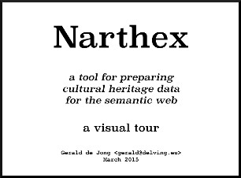

# Narthex

| >>>>>>>>>>>>>>>>>>>> | What? |
|-----|------|
|  | The **[Narthex](http://en.wikipedia.org/wiki/Narthex)** is a place which separates the entrance of the church from the inner **Nave**, and it was considered to be a place of penitence. This software is the place where metadata is collected, analyzed, and improved, in preparation for use for research or online presentation.  

## Introduction

| video
|:-----:|
|
|Watch: [http://youtu.be/uu4lNtXtgCA](http://youtu.be/uu4lNtXtgCA)

Narthex is an ingestion tool for cultural heritage metadata which has features for transforming the incoming data into target formats expressed in RDF/XML, as well as mapping terminology to given [SKOS](http://www.w3.org/2004/02/skos/) vocabularies. Vocabularies can also be mapped together and there is a system for categorizing records and generating spreadsheets with the category counts. Narthex stores the results in a triple store, and uses the file system for persisting the remainder of the information.

Technologies: 

* [AngularJS](https://angularjs.org/) - front-end browser technology
* [RequireJS](http://requirejs.org/) - javascript organization
* [Play Framework](https://playframework.com/) - web server
* [Akka](http://akka.io/) - internal processing with actors
* [Jena/Fuseki](http://jena.apache.org/documentation/serving_data/) - triple store persistence
* [Java/Swing](http://en.wikipedia.org/wiki/Swing_%28Java%29) - SIP-Creator interface

## Ingest, Map, and Improve

Introducing data to Narthex is done by either dragging and dropping an XML source file onto the browser interface, or configuring a dataset to harvest its data from an [OAI-PMH](http://www.openarchives.org/pmh/) endpoint or using the [AdLib](http://www.adlibsoft.com/) API.  Once harvested, the data sources are periodically checked for new records. This periodic harvest feature requires that the source server properly implements selection of new records, and in practice, many implementations of OAI-PMH lack this.

Narthex performs a rigorous analysis of the data it receives, separating it into fields and compiling complete unique value lists as well as frequency histograms, which are then viewable in the browser interface. This shows data providers exactly what their data looks like, sometimes giving them this view for the first time.

The task of mapping the potentially arbitrary XML structure of the incoming data to the desired target RDF/XML formats is delegated to another piece of software called [SIP-Creator](https://github.com/delving/sip-creator), which is a specialized version (referred to as "Pocket Mapper") of the software already used to build and execute very many such mappings.  It was originally developed in the context of the [Europeana](http://europeana.eu/) project, starting in 2009.  Ultimately this kind of mapping should be done in the Narthex browser interface, but in the meantime we will use this standalone Java application.

Once a mapping has been built, uploaded and executed, the resulting data can be improved further through the process of terminology mapping. This is an interactive online process where the terms used in the source data in particular fields is mapped to values from shared SKOS vocabularies.  This enables integrated data querying of many sources which where originally different terminology has been used. Before a field of terminology can be mapped to SKOS, it is first turned into a SKOS vocabulary itself, with the addition of the occurrence frequencies collected in the Narthex analysis for prioritization.

The resulting mapping connections are stored alongside the other data in the triple store, so the enrichment links made can be followed when querying.  All mappings are assigned provenance based on the user who is logged in when they are made.  With terms mapped to a common vocabulary, aggregated data can be properly searched and navigated, or indexed for search.

The category spreadsheet feature enables partitioning of records according to terms used in particular fields, and then scans all included datasets to generate an [Excel](http://en.wikipedia.org/wiki/Microsoft_Excel) spreadsheet containing the counts of all the various categories or category combinations.  This allows organizations to develop a clearer picture of the kinds of records that their datasets contain.

## Background

Initially, Narthex was funded by the [Swedish Arts Council](http://www.kulturradet.se/en/in-english/) and the [British Museum](http://www.britishmuseum.org/), specifically its [ResearchSpace](http://www.researchspace.org/) project in the context of the CultureBroker I project.

Terminology mapping features funded by the [Dutch Cultural Heritaga Agency](http://www.culturalheritageagency.nl/en), the [Norwegian Cultural Heritage Agency](http://www.kulturradet.no/), and the [Brabant Heritage Agency](http://www.erfgoedbrabant.nl/). The Category collection feature was developed for the Dutch Cultural Heritaga Agency in connection with their "Heritage Monitor" project.

Further development funding will be provided by the Swedish Arts Council and Länsstyrelsen in Västernorrland in the CultureBroker II project.

## Delving deeper

* [Actor Hierarchy](docs/actor-hierarchy.md) - users
* [Dataset Workflow](docs/dataset-workflow.md) - how a dataset progresses through the system
* [SIP-Creator Integration](docs/sip-creator-integration.md) - how the tool integrates
* [Terminology Mapping](docs/terminology-mapping.md) - terminology "skosification" and mapping to SKOS
* [Vocabulary Mapping](docs/vocabulary-mapping.md) - building skos:exactMatch links between pairs of vocabularies
* [Category Statistics](docs/category-statistics.md) - mapping terminology to categories and generating spreadsheets
* [Development and Deployment](docs/development-deployment.md) - how to build and distribute
* [Future Work](docs/future-work.md) - where to go from here

---

Contact: info@delving.eu