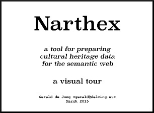

# About the name

A **[Narthex](http://en.wikipedia.org/wiki/Narthex)** is a place which separates the entrance of the church from the inner **Nave**, and it was considered to be a place of penitence. This software is the place where metadata is collected, analyzed, and improved, in preparation for use for research or online presentation.  

## Introduction

| video
|:-----:|
|
|Watch: [http://youtu.be/uu4lNtXtgCA](http://youtu.be/uu4lNtXtgCA)

Narthex is an ingestion tool for cultural heritage metadata which has features for transforming the incoming data into target formats expressed in RDF/XML. Narthex keeps its state in embedded SQLite databases (an org-level `datasets.db` for dataset properties, a per-dataset `records.db` for processed records, and a `queue.db` for background jobs), uses the file system for persisting the source and processed data, and pushes the processed records to the Hub3 LoD server via its bulk API.

Technologies: 

* [AngularJS](https://angularjs.org/) - front-end browser technology
* [RequireJS](http://requirejs.org/) - javascript organization
* [Play Framework](https://playframework.com/) - web server
* [Akka](http://akka.io/) - internal processing with actors
* [SQLite](https://www.sqlite.org/) - embedded persistence for dataset state, records, and job queue
* [Hub3](https://github.com/delving/hub3) - the LoD server that receives processed records via the bulk API

## Ingest, Map, and Improve

Introducing data to Narthex is done by either dragging and dropping an XML source file onto the browser interface, or configuring a dataset to harvest its data from an [OAI-PMH](http://www.openarchives.org/pmh/) endpoint or using the [AdLib](http://www.adlibsoft.com/) API.  Once harvested, the data sources are periodically checked for new records. This periodic harvest feature requires that the source server properly implements selection of new records, and in practice, many implementations of OAI-PMH lack this.

Narthex performs a rigorous analysis of the data it receives, separating it into fields and compiling complete unique value lists as well as frequency histograms, which are then viewable in the browser interface. This shows data providers exactly what their data looks like, sometimes giving them this view for the first time.

The task of mapping the potentially arbitrary XML structure of the incoming data to the desired target RDF/XML formats is delegated to another piece of software called [SIP-Creator](https://github.com/delving/sip-creator), which is a specialized version (referred to as "Pocket Mapper") of the software already used to build and execute very many such mappings.  It was originally developed in the context of the [Europeana](http://europeana.eu/) project, starting in 2009.  Ultimately this kind of mapping should be done in the Narthex browser interface, but in the meantime we will use this standalone Java application.

Once a mapping has been built, uploaded and executed, the resulting RDF/XML records are registered in the per-dataset `records.db` and pushed to Hub3 via the bulk API, where they are indexed for search and navigation.

Earlier versions of Narthex also included SKOS terminology mapping, vocabulary mapping, and category-statistics features backed by a triple store; these subsystems have been removed.

## Background

Initially, Narthex was funded by the [Swedish Arts Council](http://www.kulturradet.se/en/in-english/) and the [British Museum](http://www.britishmuseum.org/), specifically its [ResearchSpace](http://www.researchspace.org/) project in the context of the CultureBroker I project.

Terminology mapping features funded by the [Dutch Cultural Heritaga Agency](http://www.culturalheritageagency.nl/en), the [Norwegian Cultural Heritage Agency](http://www.kulturradet.no/), and the [Brabant Heritage Agency](http://www.erfgoedbrabant.nl/). The Category collection feature was developed for the Dutch Cultural Heritaga Agency in connection with their "Heritage Monitor" project.

Further development funding will be provided by the Swedish Arts Council and Länsstyrelsen in Västernorrland in the CultureBroker II project.

## Delving deeper

* [Actor Hierarchy](actor-hierarchy.md) - users
* [Dataset Workflow](dataset-workflow.md) - how a dataset progresses through the system
* [SIP-Creator Integration](sip-creator-integration.md) - how the tool integrates
* [Development and Deployment](development-deployment.md) - how to build and distribute
* [Future Work](future-work.md) - where to go from here

---

Contact: info@delving.eu
