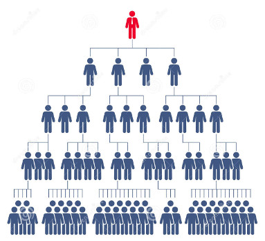

# Actor Hierarchy

Narthex provides for manipulating and mapping data on the way through to the triple store, and this kind of work can be considered meaningless if it is not recorded together with **provenance**, so it is clear where the information came from.  This is why Narthex users are referred to as "Actors", and their information is connected to the things they do. Actors are structured in a hierarchy that you are free to design as you wish.

## Top Actor

The very first user to login to Narthex, when the triple store is completely empty, becomes the top administrator.  The only thing that the super-user should do is create sub-actors and then log out.  It may make sense to think about how the management of Narthex is to be done before the hierarchy is built, at least for the top levels, and build the top levels carefully.

## OAuth Top Actors

If the OAuth configuration is added, you can use an external OAuth provider for single-sign-on function.  The configuration block for OAuth2 looks like this:

	oauth2 {
	  id = "9...r1s6"
	  secret = "g4RcD....Fp4eXNd"
	  server = "http://localhost:8000/o"
	  userUrl = "http://localhost:8000/en/api/token-user/"
	  callbackBaseUrl = "http://localhost:9000"
	}
	
Currently it is set up to make use of the Django OAuth2 mechanism of the counterpart to Narthex called Nave.  We have also had it working with github OAuth.  Each OAuth source requires minor customization still.

## Sub-Actors

Actors at the second level may be something like administration departments, and underneath may be individual administrators.  Since any actor can create sub-actors we might imagine going deeper to create an actor representing things like a classroom with students as sub-actors.  This way all activities can be recorded with provenance that can be managed and interpreted in any number of ways.

## Future Work

The actor hierarchy is still very simple but in the future we will want to have it take care of various things. Assigning mulitiple actors to be responsible for a dataset, for example, or having the work of sub-actors be validated by a super-actor.  The hierarchy could also become part of a reputation system which assigns "weights" to contributions.

---

Contact: Gerald de Jong &lt;gerald@delving.eu&gt;