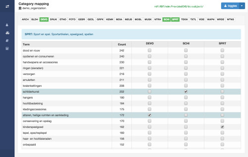

# Category Statistics

Aggregators of data from various sources may want to gather an understanding and continuously monitor the number of cultural heritage items that belong to a given set of categories.

To make this possible, Narthex requires that administrators build a small SKOS file, similar to [Categories.xml](https://github.com/delving/narthex/blob/master/test/resources/categories/Categories.xml) to define the categories they wish to use.  This file can then be introduced as a SKOS vocabulary via the normal mechanism, but under a very specific name **"categories" which causes it to be treated differently.

This little SKOS vocabulary should consist of somewhere between 5 and 30 different categories, each one accompanied by a description to which mappers refer when making their choices.  The number is small because it must be manageable, and because the user interface for category mapping lends itself to dealing with a "reasonable" number of categories.

## Mapping categories

The interface for mapping categories is different from the one for mapping terms, because categories are more general, and because a source term may imply that a record belongs to more than one category.  The mapper can highlight one or more categories, which then appear as columns of checkboxes alongside the source terms.  Any checkboxes in a row corresponding to a term can be checked to put the containing record in the chosen categories.

When a term (a row) is selected in the interface, the columns for the categories to which it already belongs are called up, and when multiple terms are selected the columns are extended accordingly.

## Generating spreadsheets

A dataset must be explicitly included in the category system, in which case it appears in the list of datasets on the Category Monitor page.  Also on that page is a button for initiating the statistics gathering

## Multiple categories

The Excel file generated by the category counting process contains a number of sheets.  The first sheets display the record counts for the **individual** categories, but not every record will belong to a single category.  Subsequent sheets in the file show the record counts for all **pairs** of categories, as well as those for **triple** categories.

## Future work

The data for the Excel file are also recorded separately as text data files, so the Narthex user interface could provide a very useful visualization of the results in the form of [Venn Diagrams](http://en.wikipedia.org/wiki/Venn_diagram) for category combinations.  There is already a dependency in place on [d3.js](http://d3js.org/) which can make this [possible](http://www.benfrederickson.com/venn-diagrams-with-d3.js/).

---

Contact: info@delving.eu;