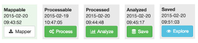

# Dataset Workflow

An empty dataset is created by just giving it a short name, and whenever it progresses through a subsequent state, the time is recorded in the triple store and shows in the browser with a button to initiate the next step.

### RAW

When the data is given to Narthex by dropping an XML file in the browser (not harvested) it is not yet known which XML tag represents the *record delimiter** and which tag or attribute represents the record's **unique identifier**.  The data in this case is stored separately in raw form and an analysis is performed in preparation for the following state. With the analysis in view, it is possible to choose the record root and unique identifier.

### RAW_ANALYZED

When a dataset is in the RAW state, the analysis is performed so that the user gains insight into the data and can choose the delimiter and unique identifier.  The analysis is rigorous, so the uniqueness of the values of a field can be assured.  Once the delimiter/unique-id choices have been made, a "source repository" (on the file system) with this information is created and the data is imported there.

### SOURCED

A dataset is sourced when it has a source repository, which either contains the provided source file, or a series of files corresponding to an initial full harvest followed by any number of periodic partial harvests which have happened subsequently.  Each harvest results in a new file added to the source repository, yet the data contents of the repository are read as if they were a single file.  The source repository effectively replaces old records with new ones before passing its contents to the other processes.

### MAPPABLE

Whenever a source repository is updated (the first time, or when a new set of changed records is fetched) its data contents are packed into a new SIP-Zip (SIP is "submission information package") file with all the necessary data (metadata information, target record definition, validation schema) which can then be downloaded and mapped by the SIP-Creator.  

The browser interface provides a download link for the mapper application, which comes from our build server. When the SIP-Creator starts up, it fetches the list of prepared SIP-Zip files so that they can be downloaded and mapping can proceed. It also checks versions against Narthex and warns if they are out of sync.

When mapping and validation is completed in the SIP-Creator (this is a long story, outside the scope of this doc), a newly-created SIP-Zip file can be uploaded to Narthex.  The source data is used in the SIP-Creator but it is not uploaded in the SIP-Zip file because this same source is already present within Narthex.

### PROCESSABLE

A dataset is "processable" if an uploaded SIP-Zip file is present, because it contains all the information necessary for generating the mapped output.  Typically the SIP-Zip is uploaded from the SIP-Creator after mapping, but to facilitate data migration and testing it is also possible to upload a SIP-Zip file directly to Narthex.  In the latter case, the dataset can be taken through all of the phases of its workflow without involving mapping in the SIP-Creator, since this mapping has already been performed to create the uploaded "migration file".

### PROCESSED

When the data has been mapped and validated using the SIP-Creator mapping engine, it appears in the form of RDF/XML in the mapped data repository.  Mapped data will initially be a single (perhaps large) file, but after each partial fetch of changed records, it will contain a series of processed files.  Similar to the source repository, the mapped repository's files are considered to be an initial file followed by a series of files which generally overlap the original file in terms of records.  Records in new files override ones in previous files.

### ANALYZED

Once the processing of a dataset is completed, Narthex can perform its "analysis" process on the result, where the values from each individual field or path within the source data is separated from the rest, sorted, collated, and counted.  The result of this analysis provides the user with a view of all the values that have ever appeared in a given field, which is the basis for both terminology mapping and category mapping.  These values appear in the form of an alphanumerically sorted list of unique values, and a histogram of value counts from the highest to the lowest.

### SAVED

Narthex saves the processed RDF data to the associated triple store. Initially this is done in one bulk operation for a dataset, but after a periodic fetch of changed records, only the changed ones need to be saved.  Either way, the timestamp associated with this state is updated.

---

Contact: info@delving.eu;