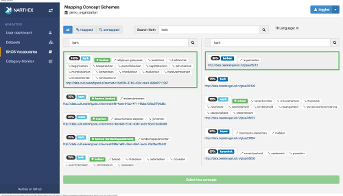

# Vocabulary Mapping

When terminology values from datasets are mapped to entries of SKOS vocabularies, the connection can lead to making links which were otherwise not known to be related.  Two datasets with their terminology mapped to one SKOS vocabulary can be queried together as one.  But if mappings have been made to **two different** vocabularies, the connection may be there but it is not yet explicit.

One SKOS vocabulary can be mapped to another with Narthex.  This means that datasets mapped to one vocabulary can be brought into contact with dataset mapped to another.  When a SKOS-SKOS mapping is created in Narthex (of course attributed to the actor who made it) the connection is recorded in the triple store as **skos: exactMatch**, and the links can then be followed to reveal new connections.

## Proximity

It is impossible to predict how terminology will be used in a source collection registration system, so the best way to find matches among the labels of a SKOS vocabulary is to do the broadest kind of comparison possible. For example, assuming that the first two or three letters are correct will greatly speed up the search, but as a result it may not reveal connections which are actually there.  We should be able to compensate for almost any typo or spelling error.

Narthex currently does a rigorous brute-force search through all vocabulary labels with a sophisticated string comparison algorithm called [Ratcliff/Obershelp Metric](http://xlinux.nist.gov/dads/HTML/ratcliffObershelp.html).  It assumes the vocabularies are "reasonably" sized, and it compares the sought after term with each and every relevant SKOS label.

The values returned from the comparison are ranked according to their "proximity" to the sought after value, and from that point it is human judgement which is responsible for finalizing the mapping.

## Interactive vs Algorithmic

The interaction when searching SKOS in Narthex is extremely rapid because the vocabularies are cached in memory on the server side.  Even searching fairly large vocabularies gives sub-second results, so the process becomes very interactive.  The actor searches for terms in two vocabularies simultaneously and the returned values are the "closest".  This is a very revealing exercise which shows a great deal about the consistency and richness of the various vocabularies.  The experience of searching is often more interesting that evaluating global statistics.

Often this mapping work is not done interactively, but rather delegated to a batch algorithm responsible for finding and making connections.  Also these algorithms should clearly be given attribution for the work they have done, and their authors be held responsible for the mistakes they may make.

## Future work

When algorithms are used to do batch matching, it is probably a good idea to browse the vocabularies and check mappings anyway.  The Narthex mapping interface allows for easy exploration of mappings that have been made.  In the future, a mechanism for adopting algorithm results could be useful.

Also, there is a limitation now in that there must be enough memory available on the server side to carry the entire SKOS target vocabulary, since the search is currently so rigorous.  For exceedingly large vocabularies, it would make sense to change this so that searching is done in an [Elastic search](http://www.elasticsearch.org/) index and explore what kind of string matching can take place using secondary storage.

## A note on terminology

The mapping system in Narthex is intended for terminology, but what falls under this category can be understood in different ways.  Terms are words which describe, so vocabularies containing many many thousands of them are extremely rare.  People tend to generalize the notion of "terminology" to include things like place names.

Place names can be recorded in SKOS, and although this is arguably not their natural habitat, they can be made to use the **skos:narrower** and **skos:broader** connections to record places within places (cities within provinces, for example).  The number of place names may also be reasonable (compared to real terminology).

Taking this further to have SKOS contain the names of people may be a bridge too far, although it seems to be a somewhat accepted practice.  In any event, when a list of person names has items numbering in the  many thousands, the current Narthex system will be overwhelmed.

---

Contact: info@delving.eu;